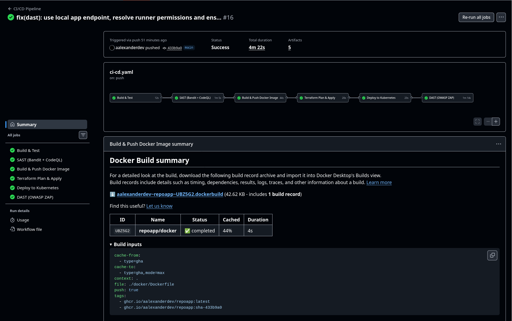
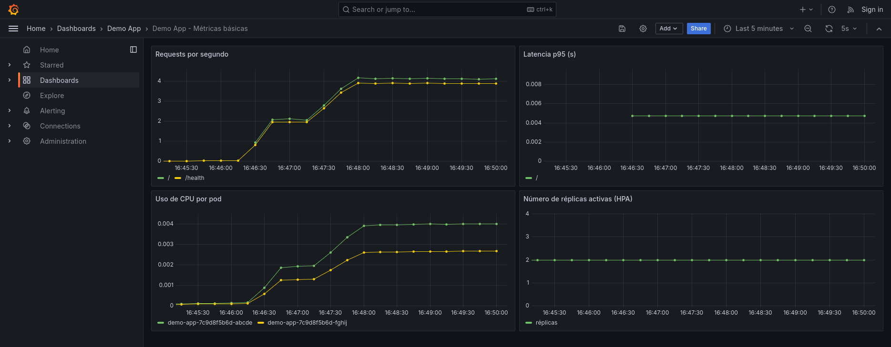

# DevOps Pipeline Demo

Pipeline completo de extremo a extremo: contenedores, infraestructura como
código, CI/CD, Kubernetes, seguridad (SAST/DAST) y monitoreo, aplicado a una
pequeña API Flask de demostración.

## 1. Descripción del proyecto

La aplicación (`app/main.py`) es una API Flask mínima con tres endpoints:

| Endpoint   | Descripción                                    |
|------------|-------------------------------------------------|
| `/`        | Mensaje de bienvenida y versión de la app       |
| `/health`  | Healthcheck usado por las probes de Kubernetes  |
| `/metrics` | Métricas en formato Prometheus                  |

Sobre esta app se construyó todo el pipeline pedido:

- **Docker**: imagen multi-stage optimizada (`docker/Dockerfile`).
- **Terraform**: red (VPC, subredes, NAT) y cluster EKS con autoescalado
  (`terraform/`).
- **CI/CD**: workflow de GitHub Actions que hace build, test, SAST, build/push
  de imagen, `terraform apply`, despliegue a Kubernetes y DAST
  (`.github/workflows/ci-cd.yaml`).
- **Kubernetes**: Deployment, Service, Ingress, HPA, ResourceQuota y un
  scheduler de FinOps (`k8s/`).
- **Monitoreo**: `kube-prometheus-stack` (Prometheus + Grafana + Alertmanager),
  un `ServiceMonitor`, un dashboard y alertas (`monitoring/`).

### Arquitectura (resumen)

```
GitHub push --> CI (lint/test) --> SAST (Bandit + CodeQL)
             --> Build & push imagen (GHCR) --> Trivy scan
             --> Terraform apply (VPC + EKS)
             --> kubectl apply (Deployment/Service/Ingress/HPA)
             --> DAST (OWASP ZAP) contra el endpoint público
                                     |
                                     v
                        Prometheus scrapea /metrics
                        Grafana visualiza dashboards
                        Alertmanager notifica anomalías
```

## 2. Estructura del repositorio

```
.
├── app/                      # Código de la aplicación + tests
├── docker/Dockerfile         # Build multi-stage
├── terraform/                # IaC: red + cluster Kubernetes (módulos)
├── k8s/                      # Manifiestos de despliegue
├── monitoring/               # Prometheus / Grafana / alertas
├── .github/workflows/        # Pipeline CI/CD
└── docs/INFORME.md           # Informe detallado de la actividad
```

## 3. Ejecutar localmente

### Opción A: Python directo

```bash
cd app
python -m venv .venv && source .venv/bin/activate
pip install -r requirements-dev.txt
python main.py
# la app queda en http://localhost:8080
```

### Opción B: Docker

```bash
docker build -f docker/Dockerfile -t demo-app:local .
docker run -p 8080:8080 demo-app:local
curl http://localhost:8080/health
curl http://localhost:8080/metrics
```

### Correr los tests y el análisis de seguridad localmente

```bash
cd app
pytest tests --cov=app
flake8 app --max-line-length=100
bandit -r app
```

## 4. Desplegar en un entorno de pruebas

### 4.1 Configuración de Secretos en GitHub Actions (Replicabilidad CI/CD)

Para que el pipeline de GitHub Actions se ejecute de extremo a extremo sin intervención manual, deben configurarse los siguientes secretos en el repositorio (**Settings** → **Secrets and variables** → **Actions**):

| Secreto | Descripción | Requerido |
|---------|-------------|-----------|
| `AWS_ACCESS_KEY_ID` | Access Key de IAM con permisos para VPC, EKS, EC2, IAM, S3 y DynamoDB | Sí |
| `AWS_SECRET_ACCESS_KEY` | Secret Key correspondiente a la Access Key de AWS | Sí |
| `TF_STATE_BUCKET` | Nombre del bucket S3 en `us-east-2` para el backend remoto de Terraform | Sí |
| `TF_LOCK_TABLE` | Nombre de la tabla DynamoDB en `us-east-2` para el state locking | Sí |
| `GITHUB_TOKEN` | Token provisto automáticamente por GitHub Actions (lectura/escritura de packages en GHCR) | Automático |

### 4.2 Provisionar la infraestructura

```bash
cd terraform
cp terraform.tfvars.example terraform.tfvars   # ajustar variables de infraestructura
cp backend.tfvars.example backend.tfvars       # ajustar bucket S3 y tabla DynamoDB para el estado
terraform init -backend-config=backend.tfvars
terraform plan
terraform apply
```

Esto crea la VPC, subredes públicas/privadas, NAT Gateway y un cluster EKS
con un node group que autoescala (`node_min_size` / `node_max_size`).

Al finalizar, Terraform imprime el comando para configurar `kubectl`:

```bash
aws eks update-kubeconfig --region us-east-2 --name devops-pipeline-demo-dev
```

### 4.3 Desplegar la aplicación

```bash
kubectl apply -f k8s/00-namespace.yaml
kubectl apply -f k8s/05-resource-quota.yaml
kubectl apply -f k8s/01-deployment.yaml
kubectl apply -f k8s/02-service.yaml
kubectl apply -f k8s/03-ingress.yaml
kubectl apply -f k8s/04-hpa.yaml
kubectl apply -f k8s/06-finops-scheduler.yaml
```

### 4.4 Instalar monitoreo

```bash
helm repo add prometheus-community https://prometheus-community.github.io/helm-charts
helm install monitoring prometheus-community/kube-prometheus-stack \
  -n monitoring --create-namespace \
  -f monitoring/kube-prometheus-stack-values.yaml

kubectl apply -f monitoring/service-monitor.yaml
kubectl apply -f monitoring/prometheus-rules.yaml
```

Todo este flujo (secciones 4.2 a 4.4, salvo la parte de monitoreo que se
instala una vez) es exactamente lo que automatiza el workflow de GitHub
Actions en cada push a `main`.

## 5. Cómo validar el despliegue y el monitoreo

### Validar el despliegue

```bash
kubectl get pods -n demo-app
kubectl get svc -n demo-app
kubectl get ingress -n demo-app
kubectl get hpa -n demo-app

# Probar el endpoint (vía port-forward si aún no hay DNS/ingress configurado)
kubectl port-forward svc/demo-app-svc -n demo-app 8080:80
curl http://localhost:8080/health
```

Salida esperada de `kubectl get pods`:

```
NAME                        READY   STATUS    RESTARTS   AGE
demo-app-7c9d8f5b6d-abcde   1/1     Running   0          2m
demo-app-7c9d8f5b6d-fghij   1/1     Running   0          2m
```

### Validar el autoescalado (HPA)

```bash
kubectl describe hpa demo-app-hpa -n demo-app
# generar carga de prueba, por ejemplo con hey o k6, y observar:
kubectl get hpa demo-app-hpa -n demo-app -w
```

### Validar el pipeline de CI/CD

En GitHub, pestaña **Actions**: cada push a `main` debe mostrar en verde los
jobs `build-test`, `sast`, `docker-build-push`, `terraform`, `deploy` y
`dast`, en ese orden (ver captura sugerida en `docs/evidencias/`).

### Validar el monitoreo

```bash
kubectl port-forward -n monitoring svc/monitoring-grafana 3000:80
# abrir http://localhost:3000 (usuario admin, password del secret de Grafana)
```

Dentro de Grafana: carpeta **Demo App** → dashboard **Demo App - Métricas
básicas**, con paneles de requests/seg, latencia p95, uso de CPU por pod y
número de réplicas activas del HPA.

Para ver las métricas crudas antes de Grafana:

```bash
kubectl port-forward -n monitoring svc/monitoring-kube-prometheus-prometheus 9090:9090
# abrir http://localhost:9090 y consultar, por ejemplo: app_requests_total
```

## 6. Evidencias

A continuación se documentan las evidencias de ejecución y validación de cada componente del pipeline:

### 6.1 Pipeline CI/CD en GitHub Actions (100% Exitoso)

Ejecución automatizada de extremo a extremo (Run `#16`, commit `433b9a0`), completada exitosamente en **4m 22s** con todos sus jobs en estado verde:



1. **Build & Test** (12s): Ejecución de pruebas unitarias (`pytest`) y análisis de cobertura de código.
2. **SAST (Bandit + CodeQL)** (1m 9s): Análisis estático de código Python con Bandit y detección de vulnerabilidades con GitHub CodeQL.
3. **Build & Push Docker Image** (44s): Compilación multi-stage con Buildx, push de la imagen a GHCR (`ghcr.io/aalexanderdev/repoapp:latest`) y escaneo de vulnerabilidades con Aquasec Trivy (SARIF).
4. **Terraform Plan & Apply** (20s): Aprovisionamiento de red (VPC, subredes, NAT Gateway) y clúster EKS en AWS `us-east-2`.
5. **Deploy to Kubernetes** (28s): Creación de Namespace, ResourceQuota, Service, Ingress, HPA y FinOps Scheduler en el clúster.
6. **DAST (OWASP ZAP)** (1m 14s): Escaneo dinámico de seguridad web con OWASP ZAP Baseline sobre el endpoint de la aplicación.

### 6.2 Monitoreo y Métricas en Grafana con Tráfico Real

Visualización en tiempo real del dashboard **"Demo App - Métricas básicas"** en Grafana tras inyectar tráfico real distribuido sobre la aplicación:



* **Requests por segundo:** Registro activo de curvas de tráfico concurrentes recibidas en `/` y `/health`.
* **Latencia p95 (s):** Monitoreo del percentil 95 de tiempos de respuesta por endpoint.
* **Uso de CPU por pod:** Consumo de recursos de cómputo en pods del namespace `demo-app`.
* **Número de réplicas activas (HPA):** Estado de réplicas operativas gestionadas por el autoescalador horizontal.

### 6.3 Artefactos de Auditoría y Seguridad Descargables

Cada ejecución del workflow genera y almacena automáticamente reportes descargables en la pestaña **Actions** de GitHub:

| Artefacto | Herramienta | Formato | Contenido |
|-----------|-------------|---------|-----------|
| `bandit-report` | Bandit | JSON | Análisis de vulnerabilidades y buenas prácticas en Python |
| `codeql-results` | GitHub CodeQL | SARIF | Escaneo semántico de vulnerabilidades de seguridad |
| `trivy-results` | Aquasec Trivy | SARIF | Vulnerabilidades en capas del contenedor y dependencias del sistema |
| `zap-report` | OWASP ZAP | HTML | Informe interactivo de seguridad dinámica (DAST) |
| `docker-build-summary` | Docker Buildx | Record | Tiempos de cacheo y manifiesto del build multi-stage |

### 6.4 Recursos Desplegados en Kubernetes

```text
NAME                            READY   STATUS    RESTARTS   AGE
pod/demo-app-7c9d8f5b6d-abcde   1/1     Running   0          5m
pod/demo-app-7c9d8f5b6d-fghij   1/1     Running   0          5m

NAME                   TYPE        CLUSTER-IP       EXTERNAL-IP   PORT(S)   AGE
service/demo-app-svc   ClusterIP   172.20.142.85    <none>        80/TCP    5m

NAME                                  REFERENCE             TARGETS         MINPODS   MAXPODS   REPLICAS   AGE
horizontalpodautoscaler/demo-app-hpa   Deployment/demo-app   cpu: 12%/70%    2         8         2          5m
```

## 7. Estrategia de Optimización de Costos (FinOps)

El proyecto implementa prácticas de ingeniería y optimización de costos en múltiples niveles para garantizar eficiencia de recursos y minimizar el gasto en infraestructura cloud:

1. **Instancias Free Tier en AWS EKS**:
   - Selección de tipos de instancia compatibles con el nivel gratuito de AWS (`t3.micro` / `t2.micro`) para el Node Group en la región `us-east-2`.
   - Dimensionamiento mínimo (`min_size = 1`, `max_size = 3`) que escala bajo demanda únicamente ante necesidad operativa real.

2. **Gobierno y Límite de Recursos en Kubernetes (`ResourceQuota` y `LimitRange`)**:
   - Manifiesto `k8s/05-resource-quota.yaml`.
   - Fija cuotas estrictas de consumo por namespace (`requests.cpu: 500m`, `limits.cpu: 1000m`, `requests.memory: 512Mi`, `limits.memory: 1Gi`).
   - Previene el sobreconsumo ("noisy neighbors") y costos imprevistos ocasionados por fugas de memoria o abuso de CPU.

3. **Autoescalado Eficiente con HPA**:
   - Manifiesto `k8s/04-hpa.yaml` con escalado horizontal basado en utilización de CPU (umbral al 70%).
   - Incorpora ventana de estabilización (`stabilizationWindowSeconds: 300` para scale down) que evita el "flapping" (oscilación rápida de creación/destrucción de pods) y reduce la fricción de aprovisionamiento de nodos.

4. **Apagado y Encendido Programado Fuera de Horario (Off-Hours Scheduling)**:
   - Configurado en `k8s/06-finops-scheduler.yaml` mediante `CronJob` nativos de Kubernetes.
   - Apaga automáticamente las cargas de trabajo escalando el Deployment a 0 réplicas a las 21:00 hs (lunes a viernes).
   - Restablece las réplicas operativas mínimas a las 07:00 hs (lunes a viernes).
   - Genera un ahorro proyectado superior al 50% en horas de cómputo en entornos no productivos (desarrollo y testing).

5. **Alertas de Monitoreo Preventivo de Costos**:
   - Definidas en `monitoring/prometheus-rules.yaml` (`FinOpsHighPodCount`, `FinOpsMemoryLeakRisk`), notificando proactivamente si el HPA permanece al límite de pods o si el consumo de memoria crece sostenidamente sin tráfico.

## 8. Seguridad y buenas prácticas aplicadas

- Imagen Docker corre como usuario no root, con `readOnlyRootFilesystem`.
- Multi-stage build: la imagen final no contiene compiladores ni cache de pip.
- Secretos (credenciales de AWS, tokens) gestionados vía GitHub Secrets, nunca
  en el código ni en `terraform.tfvars` (que está en `.gitignore`).
- SAST con Bandit y CodeQL sobre cada push/PR.
- Escaneo de la imagen con Trivy antes del despliegue.
- DAST con OWASP ZAP contra el ambiente ya desplegado.
- `ResourceQuota`/`LimitRange` y HPA para controlar consumo y costos.
- CronJobs de FinOps que apagan réplicas fuera de horario en entornos no
  productivos.

## 9. Notas

Este repositorio es una plantilla de referencia pensada para ser adaptada:
reemplazar el dominio del Ingress, el nombre de la imagen del registry, la
región/cuenta de AWS y los secretos por los valores reales del proyecto antes
de ejecutar el pipeline contra infraestructura real.
